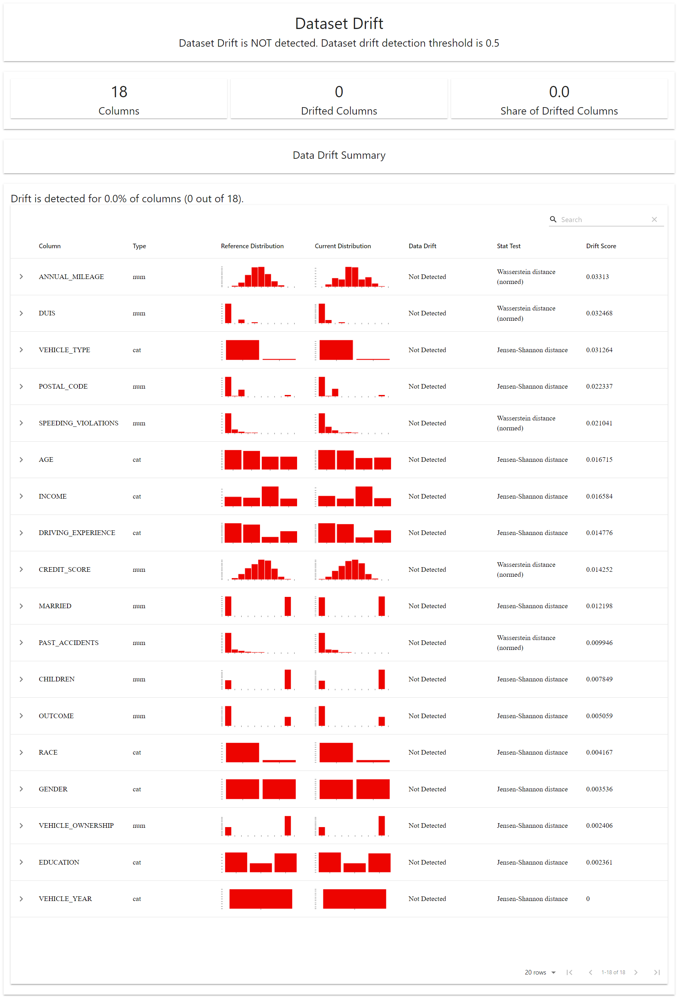
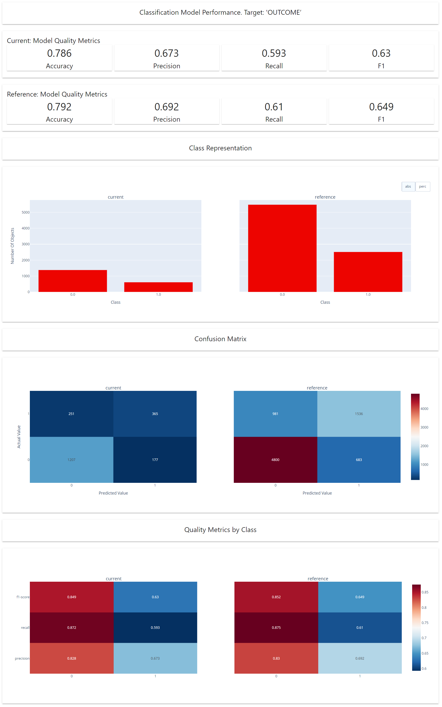

# End to End ML Project

## Project Description
This project demonstrates how to build an ML app using FastAPI and Docker.

In this project, we used a dataset called [Car Insurance Data](https://www.kaggle.com/datasets/sagnik1511/car-insurance-data), which is a company's annual car insurance data.  Our aim in the project is to find real customer behaviors through the data.

If a costumer has claimed his or her loan, the outcome column shows **1**; otherwise, it shows **0**.

## Table Of Contents ✨

- [Installation](#installation)
- [Requirements](#requirements)
- [main.py Description](#mainpy-description)
- [Data Drift Report](#data-drift-report)
- [Classification Performance Report](#classification-performance-report)
- [FastAPI](#fastapi)
- [Docker](#docker)
- [Credits](#credits)
- [License](#license)


## Installation

--------------
### 1) Clone the repository
```bash
https://github.com/SBeyzaEryilmaz/Task1.git
```
### 2) Create the virtual environment and install dependencies
```bash
poetry install
```
See the [poetry docs](https://python-poetry.org/docs/) for details on how to add/update dependencies.
### 3) Run the app
```bash
poetry run python main.py
```

## Requirements

----------
- [Poetry](https://github.com/python-poetry/poetry)
- [FastAPI](https://fastapi.tiangolo.com/)
- [Docker](https://www.docker.com/)

## main.py Description

--------
This section provides general information about the main.py and the overall CLI.

```bash
options:
  -h, --help            show this help message and exit
  --ref_data_path REF_DATA_PATH
                        Path to the dataset
  --tar_data_path TAR_DATA_PATH
                        Path to the dataset
  --model_output_folder MODEL_OUTPUT_FOLDER
                        Folder to save the model
  --monitoring_output_folder MONITORING_OUTPUT_FOLDER
                        Folder to save the monitoring results
  --data_visualization DATA_VISUALIZATION
                        Whether to visualize the data
  --train_model TRAIN_MODEL
                        Whether to train the model
  --monitor_model MONITOR_MODEL
                        Whether to monitor the model
```

Usage:
```python
python main.py [-h] [--ref_data_path REF_DATA_PATH] [--tar_data_path TAR_DATA_PATH]
                    [--model_output_folder MODEL_OUTPUT_FOLDER] [--monitoring_output_folder MONITORING_OUTPUT_FOLDER]
                    [--data_visualization DATA_VISUALIZATION]
                    [--train_model TRAIN_MODEL] [--monitor_model MONITOR_MODEL]
```
## Data Drift Report

-------
Data drift refers to the phenomenon in which the statistical properties of a dataset used for training a machine learning model change over time. This can occur for various reasons, including shifts in the underlying population, changes in data collection methods, or alterations in the environment in which the data is generated.

When data drift happens, it can have a negative impact on the performance of machine learning models. Models trained on historical data may become less accurate or even fail to make accurate predictions when applied to new data that exhibits drift.

The Data Drift report helps detect and explore changes in the input data. Applies as suitable drift detection method for numerical, categorical or text features.

Plots feature values and distributions for the two datasets.The reference dataset serves as a benchmark.  To detect a distribution shift, the change is analyzed by comparing current production data with reference data.
### Code Example

```bash
data_drift_report = Report(metrics=[
    DataDriftPreset(),
])

data_drift_report.run(reference_data=ref, current_data=cur)
data_drift_report
```
### Dataset Drift Results

<p align="center">
  
</p>

The Data Drift reports are a crucial tool for maintaining the performance and reliability of machine learning systems in dynamic environments. They help organizations adapt to changing data distributions and ensure that their models continue to provide accurate predictions.

## Classification Performance Report

--------
A classification performance report is a summary and analysis of the performance of a classification machine learning model. This report is used to evaluate how well the model is doing at correctly categorizing or classifying data into different classes or categories.

To run this report, you need to have both target and prediction columns available.
### Code Example
```python
column_mapping = ColumnMapping()

column_mapping.target = "target"
column_mapping.prediction = "prediction"

classification_performance_report = Report(metrics=[
    ClassificationPreset(),
])

classification_performance_report.run(reference_data=ref, current_data=cur, column_mapping=column_mapping)

classification_performance_report
```
### Classification Performance Results
A typical classification performance report comprises Accuracy, Precision, Recall, F1-Score, Class Representation, Confusion Matrix and  Quality Metrics by Class.

<p align="center">
  
</p>

A classification performance report is essential for assessing how well a classification model is performing, understanding its strengths and weaknesses, and making informed decisions about model tuning, feature engineering, or dataset modifications to improve classification accuracy and reliability.
## FastAPI

---------
Go to the project folder.
```bash
cd Task1
```
Initiate the FastAPI application.
```bash
python -m uvicorn ml_model_monitoring.model_deployment.api:app --reload

```
Go to http://localhost:8000 in your browser. You should receive the message "Welcome" as a result of a GET request for the '/' route.

### Predict (POST) Endpoint (http://localhost:8000/predict)
Currently it does not support batch predictions (will be added in future). As an example JSON file for prediction:
```json
{"ID": 569520,
 "AGE": "65+",
 "GENDER": "female",
 "RACE": "majority",
 "DRIVING_EXPERIENCE": "0-9y",
 "EDUCATION": "high school",
 "INCOME": "upper class",
 "CREDIT_SCORE": 0.629027313918201,
 "VEHICLE_OWNERSHIP": 1.0,
 "VEHICLE_YEAR": "after 2015",
 "MARRIED": 0.0,
 "CHILDREN": 1.0,
 "POSTAL_CODE": 10238,
 "ANNUAL_MILEAGE": 12000.0,
 "VEHICLE_TYPE": "sedan",
 "SPEEDING_VIOLATIONS": 0,
 "DUIS": 0,
 "PAST_ACCIDENTS": 0}
```

## Docker

---------
Go to the project folder.
```bash
cd Task1
```
Create a docker image.
```bash
docker build -t my_docker_image .
```
Run the container.
```bash
docker run -p 8080:8080 my_docker_image
```
Go to http://localhost:8080 in your browser.


## Credits

--------
I'd like to thank [Frightera](https://github.com/Frightera) for his assistance throughout the project.

## License

---------
This project is licensed under the **MIT Licence**, which allows users and developers to freely use, modify and distribute the project. This license describes the conditions for the use and distribution of the project, as well as a limited warranty given by the copyright holder of the project.

The full text of the MIT License can be found in the [LICENSE](https://en.wikipedia.org/wiki/MIT_License) file.
